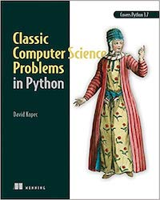

# Classic Computer Science Problems in Python
This repository contains source code to accompany the book *Classic Computer Science Problems in Python* by David Kopec. You will find the source organized by chapter. **As you read the book, each code listing contains a file name that corresponds to a file in this repository.**

## Get the Book
- [Manning](https://www.manning.com/books/classic-computer-science-problems-in-python) the publisher sells both hard copy and DRM-free eBook editions
- [Amazon](https://amzn.to/2ui96Op) if you buy the hard copy from Amazon, it will come with a way to download the eBook for free from the publisher

## Versioning and Packages
The source code in this repository requires Python 3.7 and installation of the [typing_extensions](https://github.com/python/typing/tree/master/typing_extensions) package. Due to its extensive use of Python 3.7 features (data classes, advanced type hints, etc.), most of the source code will not work with earlier versions of Python. You can install the `typing_extensions` package with `pip3 install typing_extensions` or `pip install typing_extensions` depending on your Python/pip setup.

## Questions about the Book
You can find general questions and descriptive information about the book on the [Classic Computer Science Problems](https://classicproblems.com/) website. Also, feel free to reach out to me on Twitter, [@davekopec](https://twitter.com/davekopec). If you think you found an error in the source code, please open an issue up here on GitHub.

## Free Content Based on the Book
- [Article: Constraint-Satisfaction Problems in Python](https://freecontent.manning.com/constraint-satisfaction-problems-in-python/)

## License
All of the source code in this repository is released under the Apache License version 2.0. See `LICENSE`.

## Other Books and Languages
This is the second book in the Classic Computer Science Problems series by David Kopec and published by Manning. It aims to teach classic computer science problems in a Pythonic way. You may also want to checkout the first book in the series, *Classic Computer Science Problems in Swift*, which covers most of the same problems in a more Swifty way. You can check out the repository for that book on [GitHub as well](https://github.com/davecom/ClassicComputerScienceProblemsInSwift). A reader has also reimplemented the first five chapters of the book [in C++](https://github.com/araya-andres/classic_computer_sci).
